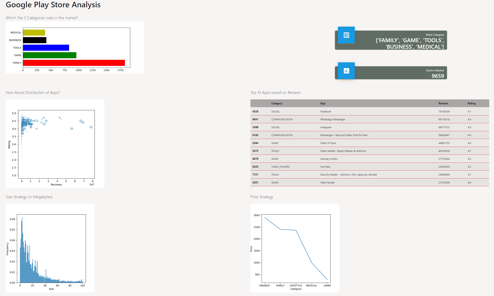

# Simple Web Dashboard application using Flask framework.
[](flask.png)

## Introduction
This project is developed as capstone project from Algoritma Academy Data Analytics Specialization. The Deliverables is expected to build simple web dashboard application, using framework Flask. This capstone is focus on Flask User Interface layout. More complete result can be found [here](dashboard.pdf)


## Dependencies
- Flask
- Matplotlib
- Pandas
- Numpy


## Rubrics

### 1. Setting Repository Github dan Environment (2 poin)
### 2. Data Preproses and Exploratory Data Analysis (2 poin)
### 3. Data Wrangling (4 poin)
### 4. Data Visualization (4 poin)
### 5. Build Flask App (4 poin)

```
